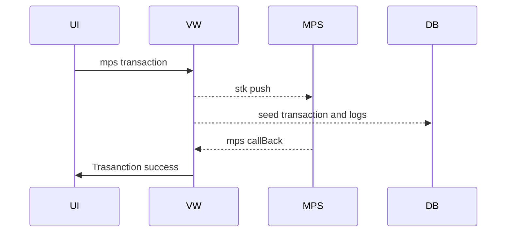
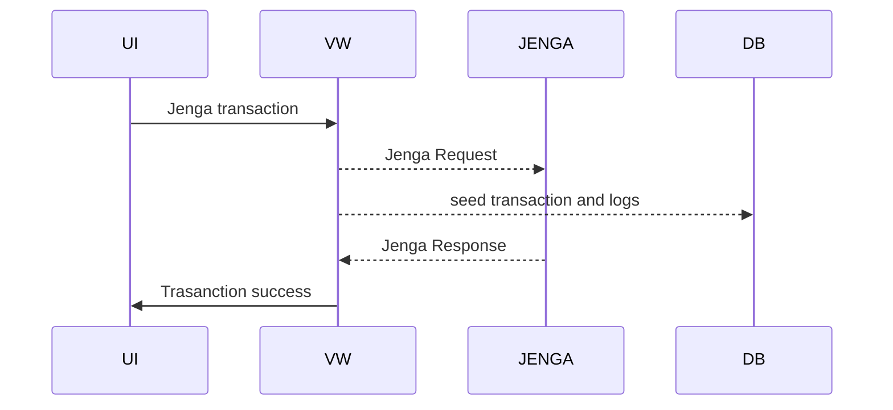

# MALIPO
local Payment gateway
####  3rd Party Apis

Daraja API
   >Mpesa Daraja Api.Consumed end point Mpesa express

Jenga API
  >Send Money with Equity Bank,Send to local banks with pesalink ,Send money to international with SWIFT,send money locally with RTGS,send money with local mobile providers.

Airtel Money
>Send and receive money with airtel

## MPS Transaction

## Jenga Transaction

